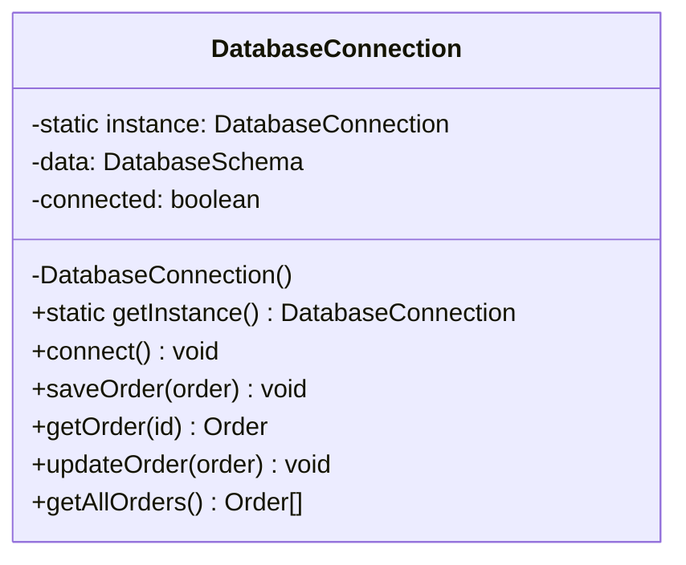
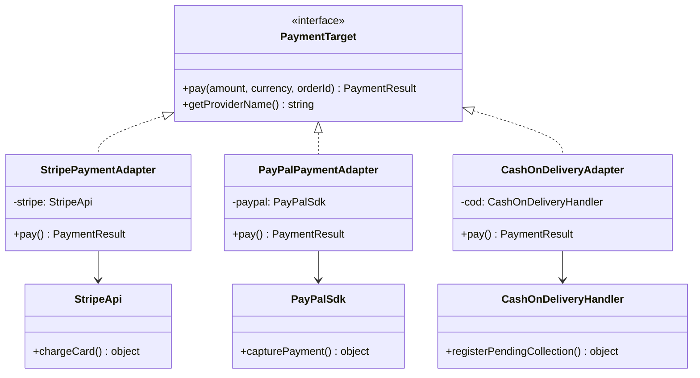
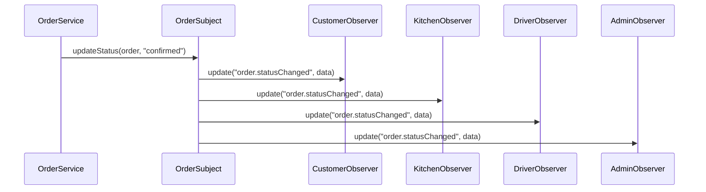
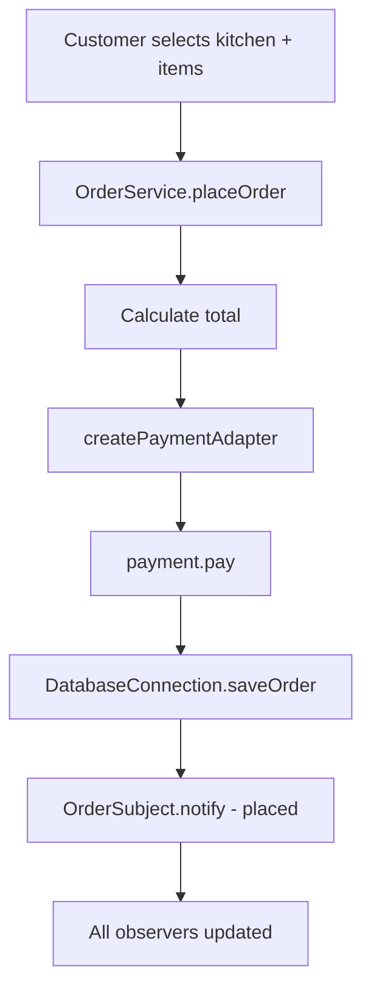

# weEatz — Object-Oriented Design & Patterns Project Report

**Course:** Object-Oriented Design & Patterns  
**Student:** Leart Saliu  
**GitHub:** [@leartt0](https://github.com/leartt0)  
**Email:** ls128837@seeu.edu.mk  
**Institution:** South East European University (SEEU)  
**Repository:** https://github.com/leartt0/OODP-project  
**Date:** June 2026

---

## Table of Contents

1. [Executive Summary](#1-executive-summary)
2. [Introduction](#2-introduction)
3. [Research on Similar Tools](#3-research-on-similar-tools)
4. [Software Requirements](#4-software-requirements)
5. [Scope of Implementation](#5-scope-of-implementation)
6. [System Overview — weEatz](#6-system-overview--weeatz)
7. [Design Patterns](#7-design-patterns)
8. [System Architecture](#8-system-architecture)
9. [Project Structure](#9-project-structure)
10. [Demonstration](#10-demonstration)
11. [Testing the Application](#11-testing-the-application)
12. [Limitations and Future Work](#12-limitations-and-future-work)
13. [Conclusion](#13-conclusion)
14. [References](#14-references)
15. [Appendix — Screenshot Checklist for PDF](#15-appendix--screenshot-checklist-for-pdf)

---

## 1. Executive Summary

This report documents **weEatz**, an online food delivery system designed for **Prishtina, Kosovo**. The project demonstrates the practical application of Gang of Four (GoF) design patterns in a realistic software domain.

weEatz operates as a **ghost kitchen network**: eight delivery-only kitchen locations across Prishtina share one menu of **20 fast-food products**. Customers place orders through a central platform; kitchens prepare food; couriers deliver; and headquarters monitors operations.

The implementation is a **working TypeScript console application** that demonstrates:

| Pattern | Category | Status |
| ------- | -------- | ------ |
| Singleton | Creational | **Mandatory — implemented** |
| Adapter | Structural | **Mandatory — implemented** |
| Observer | Behavioral | **Mandatory — implemented** |
| Composite | Structural | Optional — implemented |
| Iterator | Behavioral | Optional — implemented |

The project intentionally implements a **subset** of full production requirements (as permitted by the assignment brief), while documenting the complete requirement set derived from research on comparable delivery platforms.

---

## 2. Introduction

### 2.1 Problem Statement

Modern food delivery platforms must coordinate multiple actors — customers, kitchens, payment providers, couriers, and administrators — while remaining extensible as new features and integrations are added. Object-oriented design patterns provide proven solutions to recurring structural and behavioral problems in such systems.

### 2.2 Project Goal

Develop a demonstrable software prototype that:

1. Models a believable food delivery business (weEatz in Prishtina).
2. Implements three mandatory design patterns (Singleton, Adapter, Observer).
3. Optionally implements Composite and Iterator for menu management.
4. Documents requirements based on research of similar real-world tools.
5. Explains **what** was built, **which patterns** were used, and **how** each pattern solves a specific design problem.

### 2.3 Deliverables

| Deliverable | Location |
| ----------- | -------- |
| Source code | `src/` |
| Runnable demo | `npm start` |
| This report | `docs/PROJECT_REPORT.md` |
| GitHub repository | https://github.com/leartt0/OODP-project |

---

## 3. Research on Similar Tools

To define realistic software requirements, similar food delivery platforms were researched. The focus was on regional Balkan services and international apps operating in Kosovo.

### 3.1 Platforms Studied

| Platform | Region / Availability | Business Model | Notable Features |
| -------- | --------------------- | -------------- | ---------------- |
| [Korpa.mk](https://korpa.mk) | North Macedonia | Multi-restaurant marketplace | Restaurant search, cart, online payment, order tracking |
| [Kliknijadi.mk](https://kliknijadi.mk) | North Macedonia | Multi-vendor delivery | Category browsing, promotions, delivery scheduling |
| [Glovo](https://glovoapp.com) | Kosovo (Prishtina) | Multi-category delivery | Real-time tracking, multiple payment methods, courier app |
| [Wolt](https://wolt.com) | Kosovo (Prishtina) | Restaurant + retail delivery | Menu categories, ratings, scheduled delivery |
| KFC Online Ordering | Macedonia / regional | Single-brand fast food | Fixed product catalog, pickup and delivery, simple checkout |

### 3.2 Common Features Across Platforms

Analysis of the above tools revealed recurring functional areas:

1. **Discovery** — browse restaurants or kitchens by location and cuisine.
2. **Catalog** — hierarchical menus (categories → items → modifiers).
3. **Cart & Checkout** — line items, totals, delivery address.
4. **Payments** — credit card, digital wallets (PayPal), cash on delivery.
5. **Order Lifecycle** — status progression from placed to delivered.
6. **Notifications** — updates to customer, kitchen staff, couriers, and admin.
7. **Persistence** — orders stored for history, reporting, and recovery.

### 3.3 Ghost Kitchen Model

Unlike Korpa.mk or Glovo (which list many independent restaurants), **weEatz uses a ghost kitchen model**:

- One brand, **multiple prep locations** in different city districts.
- **Shared menu** across all kitchens (operational efficiency).
- Customer selects the **nearest kitchen** for faster delivery.
- No dine-in — delivery and pickup only.

This model is used by global brands (e.g., CloudKitchens, Reef Technology) and fits a single-brand fast-food operation in Prishtina.

### 3.4 Requirements Derived from Research

From the platform analysis, the following requirement categories were identified for a production-grade weEatz system. The next section maps each requirement to implementation status.

---

## 4. Software Requirements

### 4.1 Functional Requirements

| ID | Requirement | Description | Priority | Implemented |
| -- | ----------- | ----------- | -------- | ----------- |
| FR-01 | User registration | Customers create accounts with email/phone | High | **No** — out of scope |
| FR-02 | User authentication | Secure login (JWT / OAuth) | High | **No** — out of scope |
| FR-03 | Browse ghost kitchens | List kitchens by Prishtina district | High | **Yes** — 8 locations |
| FR-04 | View menu | Hierarchical catalog with categories and items | High | **Yes** — 20 products, Composite |
| FR-05 | Search / filter menu | Find items across categories | Medium | **Yes** — Iterator flattens menu |
| FR-06 | Shopping cart | Add/remove items, calculate subtotal | High | **Yes** — order line items in demo |
| FR-07 | Checkout | Confirm order with address and payment method | High | **Yes** — `OrderService.placeOrder()` |
| FR-08 | Credit card payment | Process card via payment gateway | High | **Yes** — Stripe Adapter |
| FR-09 | PayPal payment | Process via PayPal SDK | Medium | **Yes** — PayPal Adapter |
| FR-10 | Cash on delivery | Register pending collection at door | Medium | **Yes** — COD Adapter |
| FR-11 | Order persistence | Save orders to database | High | **Yes** — Singleton + JSON file |
| FR-12 | Order status tracking | Lifecycle: placed → delivered | High | **Yes** — Observer pattern |
| FR-13 | Customer notifications | Push/email on status change | High | **Yes** — CustomerNotificationObserver |
| FR-14 | Kitchen notifications | Alert kitchen on new/confirmed orders | High | **Yes** — GhostKitchenNotificationObserver |
| FR-15 | Courier dispatch | Notify driver when food is ready | Medium | **Yes** — DriverNotificationObserver |
| FR-16 | HQ dashboard | Admin analytics on all orders | Medium | **Yes** — AdminDashboardObserver |
| FR-17 | Order history | Customer views past orders | Low | **Partial** — `getAllOrders()` |
| FR-18 | Promotions / discounts | Coupon codes, happy hour | Low | **No** |
| FR-19 | GPS routing | Nearest kitchen by customer location | Medium | **No** |
| FR-20 | Real-time map tracking | Live courier position on map | Low | **No** |
| FR-21 | Ratings & reviews | Post-delivery feedback | Low | **No** |
| FR-22 | Mobile app (iOS/Android) | Native or React Native client | High | **No** — console demo only |

### 4.2 Non-Functional Requirements

| ID | Requirement | Description | How Addressed |
| -- | ----------- | ----------- | ------------- |
| NFR-01 | Single DB connection | Avoid duplicate connections and inconsistent state | **Singleton** — `DatabaseConnection` |
| NFR-02 | Payment extensibility | Add new providers without changing order logic | **Adapter** — `PaymentTarget` interface |
| NFR-03 | Loose coupling (notifications) | Decouple order service from notification channels | **Observer** — `OrderSubject` / `Observer` |
| NFR-04 | Extensible menu structure | Add categories/items without client changes | **Composite** — `MenuCategory` / `MenuItem` |
| NFR-05 | Uniform menu traversal | Iterate all products regardless of tree depth | **Iterator** — `MenuIterator` |
| NFR-06 | Maintainability | Clear module separation by pattern | Package structure in `src/` |
| NFR-07 | Portability | Runs on Node.js 18+ without external services | JSON file storage, simulated payment APIs |

### 4.3 Actors

| Actor | Role |
| ----- | ---- |
| Customer | Browses menu, places order, receives status updates |
| Ghost Kitchen Staff | Receives and prepares orders at one of 8 locations |
| Courier | Picks up prepared order and delivers to customer |
| weEatz HQ (Admin) | Monitors all orders and business metrics |
| Payment Provider | External service (Stripe, PayPal) or COD handler |

---

## 5. Scope of Implementation

Per the assignment brief, **the entire requirement set does not need to be implemented**. This section clarifies what was and was not built.

### 5.1 Implemented (In Scope)

- Console demo application (`npm start`)
- 8 ghost kitchen locations in Prishtina
- 20-item fast-food menu (burgers, sandwiches, sides, drinks)
- Order placement with line items and total calculation
- Three payment methods via Adapter pattern
- Order persistence to `data/orders.json` via Singleton
- Full order lifecycle with four Observer subscribers
- Composite menu tree with Iterator traversal
- TypeScript source with documented pattern usage

### 5.2 Not Implemented (Documented Only)

- Web or mobile user interface
- User registration and authentication
- GPS-based kitchen routing
- Real-time courier map
- Promotions, loyalty, ratings
- Production database (PostgreSQL)
- Real Stripe/PayPal API integration (simulated third-party classes)

This scope is **acceptable** because the assignment evaluates design pattern understanding and requirement analysis, not a full commercial product.

---

## 6. System Overview — weEatz

### 6.1 Business Context

| Attribute | Value |
| --------- | ----- |
| Product name | weEatz |
| City | Prishtina, Kosovo |
| Model | Ghost kitchen network (delivery-only) |
| Kitchen count | 8 |
| Menu size | 20 products |
| Price range | 1.00 – 6.80 EUR |
| Currencies | EUR |
| Payment methods | Credit card, PayPal, cash on delivery |

### 6.2 Ghost Kitchen Locations

| # | Kitchen Name | District |
| - | ------------ | -------- |
| 1 | weEatz Dardania | Dardania |
| 2 | weEatz Ulpiana | Ulpiana |
| 3 | weEatz Bregu i Diellit | Bregu i Diellit |
| 4 | weEatz Lakrishtë | Lakrishtë |
| 5 | weEatz Veternik | Veternik |
| 6 | weEatz Kodra e Trimave | Kodra e Trimave |
| 7 | weEatz Sunny Hill | Sunny Hill |
| 8 | weEatz Aktash | Aktash |

### 6.3 Product Catalog (20 Items)

| Category | Count | Examples |
| -------- | ----- | -------- |
| Burgers | 6 | Classic Smash Burger, BBQ Bacon Burger, Spicy Hellfire Burger |
| Sandwiches & Wraps | 5 | Philly Cheese Steak, Falafel Wrap, Club Sandwich |
| Sides | 5 | Crispy Fries, Loaded Nachos, Mozzarella Sticks |
| Drinks | 4 | Coca-Cola, Fanta, Rugova Water 0.5L, Fresh Lemonade |

---

## 7. Design Patterns

This section explains each pattern: the **problem**, the **solution**, **participants**, and **how it appears in code**.

---

### 7.1 Singleton (Creational) — Mandatory

#### Problem

Multiple parts of the application (order placement, status updates, reporting) need access to the same data store. Creating a new database connection on every operation wastes resources and can cause inconsistent reads/writes.

#### Solution

Ensure exactly **one instance** of `DatabaseConnection` exists for the application lifetime. A private constructor prevents external instantiation; `getInstance()` returns the shared instance.

#### Class Diagram



#### Key Code

```typescript
// src/singleton/DatabaseConnection.ts
export class DatabaseConnection {
  private static instance: DatabaseConnection | null = null;

  private constructor() {}

  static getInstance(): DatabaseConnection {
    if (!DatabaseConnection.instance) {
      DatabaseConnection.instance = new DatabaseConnection();
    }
    return DatabaseConnection.instance;
  }
}
```

#### How It Is Used

- `OrderService` calls `DatabaseConnection.getInstance()` in its constructor.
- The demo creates two references (`db1`, `db2`) and confirms `db1 === db2`.
- Orders persist to `data/orders.json`.

#### Benefits

- Controlled access to shared state.
- Lazy initialization (instance created on first `getInstance()` call).
- Single point for future migration to PostgreSQL.

---

### 7.2 Adapter (Structural) — Mandatory

#### Problem

Payment providers expose **incompatible APIs**:

| Provider | Native Method | Parameters |
| -------- | ------------- | ---------- |
| Stripe | `chargeCard()` | `cardToken`, `amountCents`, `ref` |
| PayPal | `capturePayment()` | `orderRef`, `value`, `currencyCode` |
| Cash on Delivery | `registerPendingCollection()` | `deliveryId`, `amount` |

The order service needs **one uniform interface**: `pay(amount, currency, orderId)`.

#### Solution

The **Adapter pattern** wraps each third-party class behind a common `PaymentTarget` interface. `OrderService` calls `payment.pay()` without knowing which provider is underneath.

#### Class Diagram



#### Key Code

```typescript
// src/adapter/PaymentAdapter.ts
export class StripePaymentAdapter implements PaymentTarget {
  pay(amount: number, currency: string, orderId: string): PaymentResult {
    const cents = Math.round(amount * 100);
    const response = this.stripe.chargeCard("tok_demo", cents, orderId);
    return { success: true, transactionId: response.charge_id, message: "..." };
  }
}

export function createPaymentAdapter(provider: PaymentProvider): PaymentTarget {
  switch (provider) {
    case "credit_card": return new StripePaymentAdapter();
    case "paypal":      return new PayPalPaymentAdapter();
    case "cash_on_delivery": return new CashOnDeliveryAdapter();
  }
}
```

#### How It Is Used

- Demo places three orders using `credit_card`, `paypal`, and `cash_on_delivery`.
- `OrderService` uses `createPaymentAdapter()` — no `if/else` on provider-specific APIs in the service layer.

#### Benefits

- Open/Closed Principle: add `ApplePayAdapter` without modifying `OrderService`.
- Isolates third-party API changes to adapter classes.

---

### 7.3 Observer (Behavioral) — Mandatory

#### Problem

When an order status changes, **four different parties** must be notified:

1. Customer (weEatz app)
2. Ghost kitchen (prep screen)
3. Courier (dispatch)
4. weEatz HQ (analytics)

Hard-coding all notification logic inside `OrderService` creates tight coupling and makes adding new subscribers difficult.

#### Solution

**Subject** (`OrderSubject`) maintains a list of **Observers** and broadcasts events. Each observer implements `update(event, data)` and reacts only to relevant events.

#### Sequence Diagram



#### Order Lifecycle

```
placed → confirmed → preparing → out_for_delivery → delivered
```

| Status | Customer App | Ghost Kitchen | Courier | HQ |
| ------ | ------------ | ------------- | ------- | -- |
| placed | ✓ | ✓ (new order) | — | ✓ |
| confirmed | ✓ | ✓ (start prep) | — | ✓ |
| preparing | ✓ | ✓ (cooking) | — | ✓ |
| out_for_delivery | ✓ | — | ✓ (pick up) | ✓ |
| delivered | ✓ | — | — | ✓ |

#### Key Code

```typescript
// src/observer/OrderNotificationSystem.ts
export class OrderSubject implements Subject {
  private observers: Observer[] = [];

  attach(observer: Observer): void { ... }
  notify(event: string, data: Record<string, unknown>): void {
    for (const observer of this.observers) {
      observer.update(event, data);
    }
  }
}
```

#### How It Is Used

- `OrderService` constructor attaches four observers to `OrderSubject`.
- `processOrderLifecycle()` advances status through all steps; each step triggers notifications.

#### Benefits

- New observers (e.g., `SMSNotificationObserver`) can be added without changing `OrderService`.
- Each observer has a single responsibility.

---

### 7.4 Composite (Structural) — Optional

#### Problem

The menu is hierarchical: root menu → categories (Burgers, Drinks) → individual items. Client code should treat a **single item** and an **entire category** through the same interface (e.g., for display or price summation).

#### Solution

`MenuComponent` interface is implemented by:

- **Leaf:** `MenuItem` — one product with price and description.
- **Composite:** `MenuCategory` — container holding child `MenuComponent` nodes.

#### Structure

```
weEatz Menu (MenuCategory)
├── Burgers (MenuCategory)
│   ├── Classic Smash Burger (MenuItem)
│   ├── Double Cheese Burger (MenuItem)
│   └── ...
├── Sandwiches & Wraps (MenuCategory)
│   └── ...
├── Sides (MenuCategory)
│   └── ...
└── Drinks (MenuCategory)
    ├── Coca-Cola 0.33L (MenuItem)
    ├── Rugova Water 0.5L (MenuItem)
    └── ...
```

#### Key Code

```typescript
// src/composite/MenuComponent.ts
export class MenuCategory extends BaseMenuComponent {
  private children: MenuComponent[] = [];

  add(component: MenuComponent): void {
    this.children.push(component);
  }

  getItems(): MenuItemData[] {
    return this.children.flatMap((c) => c.getItems());
  }
}
```

#### Benefits

- Uniform treatment of individual items and category groups.
- Easy to add new categories or nest sub-menus.

---

### 7.5 Iterator (Behavioral) — Optional

#### Problem

The cart, search, and reporting features need to walk **all 20 products** without exposing the internal category tree structure to client code.

#### Solution

`MenuIterator` takes a `MenuComponent` (the composite menu root), flattens it via `getItems()`, and implements the standard JavaScript `Iterator` protocol (`next()`, `[Symbol.iterator]()`).

#### Key Code

```typescript
// src/iterator/MenuIterator.ts
export class MenuIterator implements Iterator<MenuItemData> {
  constructor(menu: MenuComponent) {
    this.items = menu.getItems();
  }

  next(): IteratorResult<MenuItemData> { ... }
  count(): number { return this.items.length; }
}
```

#### How It Is Used

```typescript
const iterator = new MenuIterator(menu);
for (const item of iterator) {
  console.log(item.name, item.price);
}
// Output: "Iterator found 20 orderable products"
```

#### Benefits

- Clients iterate products without knowing category structure.
- Supports `for...of` loops and future filtering extensions.

---

### 7.6 Pattern Summary Table

| Pattern | GoF Category | Class(es) | Collaborates With |
| ------- | ------------ | --------- | ----------------- |
| Singleton | Creational | `DatabaseConnection` | `OrderService` |
| Adapter | Structural | `StripePaymentAdapter`, `PayPalPaymentAdapter`, `CashOnDeliveryAdapter` | `OrderService`, third-party APIs |
| Observer | Behavioral | `OrderSubject`, 4 concrete observers | `OrderService` |
| Composite | Structural | `MenuCategory`, `MenuItem` | `WeEatzMenu`, `MenuIterator` |
| Iterator | Behavioral | `MenuIterator` | `MenuComponent` |

---

## 8. System Architecture

### 8.1 High-Level Architecture

```
┌─────────────────────────────────────────────────────────────────┐
│                        weEatz Console Demo                       │
│                         (src/index.ts)                           │
└────────────────────────────┬────────────────────────────────────┘
                             │
         ┌───────────────────┼───────────────────┐
         ▼                   ▼                   ▼
┌─────────────────┐  ┌─────────────────┐  ┌──────────────────┐
│  Menu Subsystem │  │  OrderService   │  │ Ghost Kitchens   │
│  Composite      │  │                 │  │ (domain data)    │
│  Iterator       │  │  ┌───────────┐  │  8 locations     │
│  20 products    │  │  │ Singleton │  │                  │
└─────────────────┘  │  │ Database  │  │                  │
                       │  └─────┬─────┘  │                  │
                       │        │        │                  │
                       │  ┌─────▼─────┐  │                  │
                       │  │  Adapter  │──┼──▶ Stripe API    │
                       │  │  Payment  │  │    PayPal SDK     │
                       │  └───────────┘  │    COD Handler    │
                       │                 │                  │
                       │  ┌───────────┐  │                  │
                       │  │ Observer  │──┼──▶ Customer App  │
                       │  │ Subject   │  │    Ghost Kitchen │
                       │  └───────────┘  │    Courier       │
                       └─────────────────┘    weEatz HQ     │
                                              └──────────────────┘
                             │
                             ▼
                    ┌─────────────────┐
                    │ data/orders.json │
                    └─────────────────┘
```

### 8.2 Order Placement Flow



---

## 9. Project Structure

```
OODP-project/
├── docs/
│   ├── PROJECT_REPORT.md      ← This document
│   └── REPORT.md              ← Shorter summary
├── src/
│   ├── index.ts               ← Demo entry point
│   ├── domain/
│   │   ├── types.ts           ← Shared interfaces
│   │   └── ghostKitchens.ts   ← 8 kitchen locations
│   ├── singleton/
│   │   └── DatabaseConnection.ts
│   ├── adapter/
│   │   ├── PaymentAdapter.ts
│   │   └── third-party-apis.ts
│   ├── observer/
│   │   ├── Observer.ts
│   │   └── OrderNotificationSystem.ts
│   ├── composite/
│   │   ├── MenuComponent.ts
│   │   └── WeEatzMenu.ts
│   ├── iterator/
│   │   └── MenuIterator.ts
│   └── services/
│       └── OrderService.ts
├── data/
│   └── orders.json            ← Persisted orders
├── package.json
├── README.md
└── LICENSE
```

---

## 10. Demonstration

### 10.1 How to Run

**Requirements:** Node.js 18 or later.

```bash
git clone https://github.com/leartt0/OODP-project.git
cd OODP-project
npm install
npm start
```

### 10.2 Demo Sections

The demo (`src/index.ts`) runs four sections in sequence:

| Step | Pattern(s) | What Happens |
| ---- | ---------- | ------------ |
| 1 | Singleton | Connect to DB; prove `db1 === db2` |
| 2 | — | List 8 ghost kitchens in Prishtina |
| 3 | Composite, Iterator | Display full menu; iterator lists 20 products |
| 4 | Adapter, Observer | Place 3 orders (card, PayPal, COD); run lifecycle |

### 10.3 Sample Output (Abbreviated)

```
weEatz — Online Food Delivery System
Prishtina, Kosovo · 8 Ghost Kitchen Locations

1. SINGLETON — Database Connection
  [DB Singleton] Connected to .../data/orders.json
  Same instance? Yes ✓

2. GHOST KITCHENS — 8 Locations in Prishtina
  • weEatz Dardania — Dardania
  • weEatz Kodra e Trimave — Kodra e Trimave
  ...

3. COMPOSITE + ITERATOR — Fast Food Menu (20 products)
  [Drinks]
    • Rugova Water 0.5L — 1.00 EUR (Still water)
  Iterator found 20 orderable products

4. ADAPTER + OBSERVER — Place Order & Track Delivery
  Payment via credit_card adapter:
  → Stripe charged 18.8 EUR
  [weEatz App] Order WE-...: placed → confirmed
  [Ghost Kitchen] weEatz Dardania — cooking order ...
  [Courier] Pick up order ...
  [weEatz HQ] Tracked — WE-...:delivered

Demo complete.
```

---

## 11. Testing the Application

The project is validated by running the demo and observing output. Suggested verification checklist:

| # | Test | Expected Result |
| - | ---- | --------------- |
| 1 | `npm start` exits with code 0 | Demo completes without errors |
| 2 | Singleton check | "Same instance? Yes ✓" |
| 3 | Kitchen count | 8 locations listed |
| 4 | Iterator count | 20 products |
| 5 | Credit card order | Stripe adapter message printed |
| 6 | PayPal order | PayPal adapter message printed |
| 7 | COD order | Cash on delivery message printed |
| 8 | Lifecycle | 4 status transitions with 4 observer types |
| 9 | Persistence | `data/orders.json` contains saved orders |
| 10 | Order count | Final line shows total orders in database |

---

## 12. Limitations and Future Work

### 12.1 Current Limitations

- Console-only interface (no GUI or mobile app).
- Simulated payment APIs (not connected to real Stripe/PayPal).
- JSON file storage (not suitable for production concurrency).
- No authentication, authorization, or input validation.
- No automated unit test suite.

### 12.2 Future Enhancements

| Enhancement | Pattern Relevance |
| ----------- | ----------------- |
| React Native mobile app | Observer for push notifications |
| PostgreSQL database | Singleton connection pool |
| Apple Pay / Google Pay | New Adapter implementations |
| Promotions engine | Strategy pattern (future) |
| Nearest-kitchen routing | Could use Strategy or Factory |
| REST API layer | Facade pattern (future) |

---

## 13. Conclusion

**weEatz** demonstrates how Gang of Four design patterns solve real problems in a food delivery system:

- **Singleton** centralizes data access for order persistence.
- **Adapter** unifies incompatible payment provider APIs.
- **Observer** decouples order status changes from notification logic.
- **Composite** models a hierarchical menu structure.
- **Iterator** provides uniform traversal of all menu products.

The project fulfills the assignment requirements: a documented report explaining the developed software, the patterns used and how they are applied, requirements research based on similar tools (Korpa.mk, Kliknijadi.mk, Glovo, Wolt), and a working implementation of the core patterns — without needing to implement every production feature.

**Repository:** https://github.com/leartt0/OODP-project

---

## 14. References

1. Gamma, E., Helm, R., Johnson, R., & Vlissides, J. (1994). *Design Patterns: Elements of Reusable Object-Oriented Software*. Addison-Wesley.
2. Korpa.mk — https://korpa.mk
3. Kliknijadi.mk — https://kliknijadi.mk
4. Glovo — https://glovoapp.com
5. Wolt — https://wolt.com
6. weEatz source code — https://github.com/leartt0/OODP-project
7. TypeScript Documentation — https://www.typescriptlang.org/docs/

---

## 15. Appendix — Screenshot Checklist for PDF

When converting this report to PDF, include the following screenshots as figures:

| Figure | What to Capture | How |
| ------ | --------------- | --- |
| Fig. 1 | Project README on GitHub | Browser screenshot of repo page |
| Fig. 2 | Project folder structure | VS Code / Cursor file explorer |
| Fig. 3 | Singleton demo output | Terminal after `npm start` (section 1) |
| Fig. 4 | Ghost kitchens list | Terminal output (section 2) |
| Fig. 5 | Menu display | Terminal output (section 3) |
| Fig. 6 | Payment adapters | Terminal output showing Stripe/PayPal/COD |
| Fig. 7 | Observer notifications | Terminal output showing lifecycle |
| Fig. 8 | `DatabaseConnection.ts` | Code editor screenshot |
| Fig. 9 | `PaymentAdapter.ts` | Code editor screenshot |
| Fig. 10 | `OrderNotificationSystem.ts` | Code editor screenshot |
| Fig. 11 | `orders.json` persisted data | Editor showing saved orders |

### Exporting to PDF

**Option A — VS Code / Cursor:**
1. Install extension: "Markdown PDF" or "Markdown Preview Enhanced"
2. Open `docs/PROJECT_REPORT.md`
3. Export / Print to PDF

**Option B — Pandoc (terminal):**
```bash
cd OODP-project
pandoc docs/PROJECT_REPORT.md -o docs/PROJECT_REPORT.pdf --toc -V geometry:margin=1in
```

**Option C — Google Docs / Word:**
1. Copy markdown content into a document
2. Insert screenshots from the checklist above
3. Export as PDF

---

*Academic work — South East European University (SEEU)*  
*Developed by Leart Saliu*
